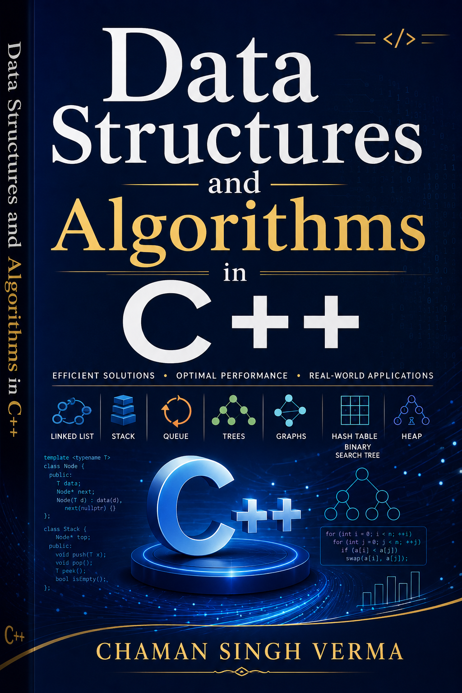

# Data Structures, Algorithms, and Applications in C++

<p align="center">
  
</p>

**Third Edition — A Modern, C++20 Approach**

A comprehensive textbook covering fundamental and advanced data structures, algorithm-design paradigms, and modern C++ programming practices. This repository contains the full book content (chapters, TeX sources) and complete, compilable C++ code examples for every data structure and algorithm presented.

---

## Comparative Assessment

This book is the third edition of Sartaj Sahni's *Data Structures, Algorithms, and Applications in C++*, first published in 1998. The second edition remains widely assigned in university courses, but its C++ code predates C++11 and its coverage omits several topics that have since become standard. This edition modernizes the codebase, fills those gaps, and repositions the book as a self-contained two-semester text. The comparison below is an honest assessment of where it stands relative to the most widely used references.

### Comparison with Established Textbooks

| | **This Book (3rd Ed.)** | **Sahni (2nd Ed.)** | **Knuth (TAOCP)** | **Cormen (CLRS)** | **Sedgewick (4th Ed.)** | **Brass (*Advanced DS*)** | **Goodrich & Tamassia** |
|---|---|---|---|---|---|---|---|
| **Language** | C++20 | C++ (pre-C++11) | MMIX assembly | Pseudocode | Java | Pseudocode | Pseudocode / Java |
| **RAII / Smart Pointers** | Yes, throughout | No | No | No | No | No | No |
| **Modern C++ Features** | Concepts, ranges, `constexpr`, coroutines | None | N/A | N/A | N/A | N/A | N/A |
| **Probabilistic Structures** | Full chapter (Bloom, HLL, Count-Min) | Not covered | Partial | Chapter 13 (skip lists, universal hashing) | Not covered | Not covered | Not covered |
| **Segment / Fenwick Trees** | Full treatment with lazy propagation | Not covered | Partial | Not covered | Not covered | Not covered | Not covered |
| **Suffix Arrays & LCP** | Doubling algorithm, Kasai's | Not covered | Suffix trees | Not covered | Not covered | Not covered | Not covered |
| **Max Flow** | Ford-Fulkerson, Edmonds-Karp, Dinic's | Not covered | Extensive | Ford-Fulkerson, Edmonds-Karp | Not covered | Not covered | Not covered |
| **Benchmarking** | Google Benchmark, `std::chrono` | Not covered | N/A | Not covered | Empirical performance (Chapter 1) | N/A | Not covered |
| **STL Connections** | Every structure mapped to STL equivalent | Limited | N/A | N/A | Java Collections mapped | N/A | Java Collections mapped |
| **Exercises** | 3-tier (drill / application / research) | 2-tier | Extensive | 4-tier (research included) | Varies by chapter | Research-focused | 3-tier |
| **Practical Applications** | Per-section real-world use cases | Some | Theoretical | Moderate | Strong (real-world data) | Few | Moderate |

### Detailed Assessment

**Sartaj Sahni — *Data Structures, Algorithms, and Applications in C++* (2nd Ed.)**

Sahni's book is the direct ancestor of this edition, and its strengths are well known: clear exposition, complete working code, and a balance between theory and implementation that few textbooks achieve. The second edition, however, predates C++11. Its code uses raw `new`/`delete`, manual memory management, and C-style idioms that do not reflect how C++ is written in practice today. It also does not cover segment trees, probabilistic data structures, suffix arrays, or modern max-flow algorithms — topics that have become standard in competitive programming, systems design, and technical interviews. This third edition preserves Sahni's pedagogical structure while modernizing every line of code and filling the gaps that twenty years of software engineering have exposed.

**Donald Knuth — *The Art of Computer Programming***

Knuth's work is the definitive theoretical reference for algorithm analysis. Its depth on sorting, searching, and mathematical analysis is unmatched. TAOCP includes compilable code (MMIX assembly), but the language is archaic by design and not intended for practical implementation. The book assumes significant mathematical maturity and is structured as an encyclopedic reference rather than a teaching textbook. This book targets a different reader: the undergraduate or practitioner who needs to *understand, implement, and use* data structures in modern C++. Where Knuth proves theorems in full generality, this book provides working code alongside the proofs.

**Thomas Cormen et al. — *Introduction to Algorithms* (CLRS)**

CLRS is the most widely assigned algorithms textbook worldwide, and its strengths are substantial: rigorous proofs, broad coverage, and excellent exercises at multiple levels. It does cover probabilistic data structures (skip lists, universal hashing) and includes four tiers of exercises that escalate from routine to research-level. Its limitations are that it uses pseudocode throughout, does not provide implementations in any compilable language, and treats data structures primarily as a vehicle for algorithm analysis rather than as engineering artifacts with concrete memory layouts and performance characteristics. This book treats data structures and algorithms as equally important, providing both the theoretical analysis and the working C++ implementation.

**Robert Sedgewick — *Algorithms* (4th Ed.)**

Sedgewick's book is the closest comparator in terms of teaching philosophy: it pairs theory with complete, compilable implementations (in Java) and includes empirical performance measurement. Its treatment of sorting and searching is particularly strong, and its use of real-world datasets for benchmarking is a genuine strength. The limitations are language-specific (Java rather than C++), and it does not cover several topics this edition addresses: segment trees, Fenwick trees, suffix arrays, max-flow algorithms, or probabilistic data structures like Bloom filters and HyperLogLog. The coverage of balanced trees is also more limited. This book fills those gaps while offering the same theory-plus-implementation pairing that makes Sedgewick effective.

**Peter Brass — *Advanced Data Structures***

Brass excels at covering structures that most textbooks omit: finger trees, van Emde Boas layouts, fusion trees, and cache-oblivious structures. Its treatment is rigorous and valuable for graduate-level study. However, it assumes the reader already has a solid foundation in basic data structures, provides no implementations, and does not connect theory to practical engineering. It also covers some topics this edition addresses (partial coverage of suffix structures, for instance), but does so at a higher level of abstraction. This book targets a broader audience — including undergraduates encountering these structures for the first time — and provides working implementations alongside the analysis.

**Michael Goodrich & Roberto Tamassia — *Data Structures and Algorithms in C++***

Goodrich and Tamassia's book is a well-organized introductory text that covers the standard core topics with Java implementations. Its strength is its clear, systematic presentation and its companion website with additional materials. It does not, however, cover the more advanced topics this edition addresses (segment trees, suffix arrays, probabilistic structures, max-flow) and uses pseudocode rather than compilable C++ for its more complex algorithms.

### Course Materials

**MIT 6.006 / 6.046 (Erik Demaine)**

MIT's courses are well-regarded for building algorithmic intuition. The lecture notes and problem sets are freely available and widely used. They are course materials, not a textbook — they are incomplete without the lectures, they use pseudocode rather than compilable code, and they do not cover data structure implementation in any specific language. This book provides a self-contained, language-specific reference that a student can use independently.

**Stanford CS161 (Tim Roughgarden)**

Roughgarden's course (and his accompanying book *Algorithms Illuminated*) is clear on algorithm design paradigms — divide and conquer, dynamic programming, greedy methods. His treatment of graph algorithms is strong. The limitation is scope: CS161 focuses on algorithms, not data structures. It does not cover hash table internals, balanced tree rotations, union-find, or implementation-level details.

**Berkeley CS170**

Berkeley's course is well-regarded for its applied focus and strong problem sets. It covers many of the same algorithmic paradigms as MIT 6.046 but with more emphasis on practical applications. Like MIT's offering, it is not a textbook and does not provide a systematic, self-contained treatment of data structure implementation.

### What This Book Adds

1. **A complete C++20 codebase.** Every data structure is implemented with modern idioms — RAII, smart pointers, concepts, `std::span`, move semantics — that reflect how C++ is written today. Readers learn both the data structure and the language features that make it safe and efficient.

2. **Coverage gaps filled.** Probabilistic data structures (Bloom filters, HyperLogLog, Count-Min sketch), segment trees with lazy propagation, suffix arrays, and Dinic's max-flow algorithm are covered in full, with proofs and implementations. These topics appear in competitive programming, systems design, and production systems but are absent from most textbooks at this level.

3. **Performance measurement as a first-class topic.** Chapter 3 treats benchmarking with the same rigor as algorithm analysis — `std::chrono`, Google Benchmark, profiling tools, and the pitfalls of microbenchmarking. Sedgewick's book includes empirical performance analysis in Java; this book does the same for C++ with modern tooling.

4. **STL as a teaching tool.** After implementing each structure from scratch, the book shows the corresponding STL container or algorithm and discusses the design tradeoffs. This bridges the gap between "learning how it works" and "knowing when to use the standard library."

5. **A single, self-contained resource.** This book is designed to serve as the primary text for a two-semester undergraduate sequence or a graduate-level course, without requiring supplementary materials. The appendices (STL reference, NP-completeness, mathematical review) eliminate the need for external references during study.

### Honest Limitations

No book is without tradeoffs. This edition does not cover cache-oblivious structures, finger trees, or persistence — topics that Brass and some advanced courses address. The probabilistic chapter provides foundations but does not reach the depth of a specialized reference like Mitzenmacher & Upfal. The max-flow chapter covers the essential algorithms but omits push-relabel and recent developments in flow decomposition. Unlike CLRS and Sedgewick, this book does not yet have a companion website, instructor slides, or solution manual — resources that are standard for university adoption. These are conscious scope decisions and known gaps, not oversights — the goal was a single volume comprehensive enough for a full course without becoming unwieldy.

---

## Repository Structure

```
DataStruct/
├── chapters/               # Book chapters in Markdown
├── code/                   # Complete C++ implementations and tests
│   ├── *.h                 # Header-only data structure implementations
│   ├── ch*/                # Per-chapter code examples
│   ├── test_*.cpp          # Unit tests and usage examples
│   ├── standalone/         # Self-contained chapter programs
│   └── build/              # CMake build artifacts
├── tex/                    # LaTeX source files
│   ├── book.tex            # Master document
│   ├── chapters/           # Per-chapter .tex files
│   └── book.pdf            # Compiled PDF
├── books/                  # Reference PDFs
├── figures/                # Diagrams and illustrations
├── standalone/             # Standalone C++ programs per chapter
├── book-structure.md       # Detailed book structure
├── content.md              # Full table of contents
└── modern_cpp_data_structures_blueprint.md  # Author blueprint
```

## Book Contents

### Part I — Preliminaries
| Ch | Title | Topics |
|----|-------|--------|
| 1 | Modern C++ Review | RAII, smart pointers, concepts, move semantics, ranges, coroutines |
| 2 | Performance Analysis | Asymptotic notation, recursive analysis, amortized analysis, space complexity |
| 3 | Performance Measurement | `std::chrono`, Google Benchmark, profiling, memory measurement |

### Part II — Data Structures
| Ch | Title | Topics |
|----|-------|--------|
| 4 | Linear Lists | Array-based and linked lists, polynomial arithmetic |
| 5 | Arrays, Matrices & Sparse | Row/column-major, CSR/CSC, PageRank |
| 6 | Stacks | Array/linked stacks, balanced parentheses, postfix evaluation |
| 7 | Queues | Circular buffer, linked queue, deque |
| 8 | Hashing & Hash Tables | Chaining, open addressing, skip lists, Robin Hood, cuckoo, Swiss table |
| 9 | Trees & Binary Trees | Traversals, Huffman coding, expression trees |
| 10 | Priority Queues | Heaps, heap sort, leftist trees, event-driven simulation |
| 11 | Search Trees | BST, AVL, red-black, B-tree, treap |
| 12 | Graphs | Adjacency list/matrix, BFS, DFS, Dijkstra, Bellman-Ford, Floyd-Warshall, SCC |
| 13 | Strings & Tries | Tries, KMP, Rabin-Karp, suffix arrays, LCP |
| 14 | Segment/Fenwick/Union-Find | Range queries, BIT, DSU with inverse Ackermann |

### Part III — Algorithm-Design Methods
| Ch | Title | Topics |
|----|-------|--------|
| 15 | Greedy Method | Fractional knapsack, Huffman, Dijkstra, MST |
| 16 | Divide and Conquer | Merge sort, quick sort, closest pair, Strassen's |
| 17 | Dynamic Programming | 0/1 knapsack, LCS, edit distance, Floyd-Warshall |
| 18 | Backtracking & Branch and Bound | n-Queens, subset sum, TSP, 15-puzzle |
| 19 | Probabilistic Structures | Bloom filters, Count-Min sketch, HyperLogLog, reservoir sampling |
| 20 | Maximum Flow & Matching | Ford-Fulkerson, Edmonds-Karp, Dinic's, bipartite matching |

### Appendices
- **A** — C++ STL Quick Reference
- **B** — Complexity Classes and NP-Completeness
- **C** — Mathematical Review

## Building the Code

### Prerequisites

- **C++20** compiler (GCC 11+, Clang 14+, Apple Clang 15+, or MSVC 2022 17+)
- **CMake** 3.16+ (recommended) or **GNU Make**
- **Google Benchmark** (optional, for Chapter 3 benchmarks)

### Using CMake

```bash
cd code
mkdir build && cd build
cmake ..
cmake --build .
ctest
```

### Using Make

```bash
cd code
make          # Build all examples
make test     # Build and run all tests
make clean    # Remove build artifacts
```

### Running Individual Tests

```bash
cd code
make test_ch04_array_list && ./test_ch04_array_list
make test_ch05_linked_list && ./test_ch05_linked_list
```

## Code Highlights

| Header | Data Structures / Algorithms |
|--------|------------------------------|
| `ch04_array_list.h` | Dynamic array list |
| `ch05_linked_list.h` | Singly & doubly linked lists |
| `ch08_stacks.h` | Array-based & linked stacks |
| `ch09_queues.h` | Circular & linked queues |
| `ch10_hash_table.h` | Hash table with separate chaining |
| `ch11_binary_tree.h` | Binary tree traversals |
| `ch12_max_heap.h` | Max-heap & heap sort |
| `ch15_avl_tree.h` | AVL balanced search tree |
| `ch16_graph.h` | Adjacency list graph, BFS, DFS, topological sort |
| `ch17_fenwick_segment.h` | Fenwick tree, segment tree, union-find |
| `ch19_bloom_filter.h` | Bloom filter, Count-Min sketch |
| `ch20_dinic.h` | Dinic's max-flow algorithm |
| `ch21_sorting.h` | Insertion, merge, quick, heap, introsort |
| `ch22_string_algorithms.h` | KMP, Rabin-Karp, suffix array, LCP |

## Design Principles

- **RAII throughout** — no raw `new`/`delete`; smart pointers for all dynamic allocation
- **C++20 features** — concepts, `std::span`, `std::string_view`, ranges, `constexpr`, coroutines
- **Mathematical rigor** — formal definitions, theorems, complexity proofs
- **STL connections** — every manual implementation is compared with its STL equivalent
- **Gradual disclosure** — array → linked → optimized implementations
- **Three-level exercises** — drill, application, and research problems
- **Real-world applications** — each structure includes practical use cases

## Generating the PDF

```bash
cd tex
pdflatex book.tex
makeindex book
pdflatex book.tex
pdflatex book.tex
```

## License

This repository contains the source material for *Data Structures, Algorithms, and Applications in C++ (3rd Edition)*. All rights reserved by the author.

## Contributing

If you find errors in the code or text, please open an issue with:
- The chapter and section number
- A description of the error
- A suggested fix (if applicable)

---

*Built with modern C++20 — because data structures deserve modern tools.*
