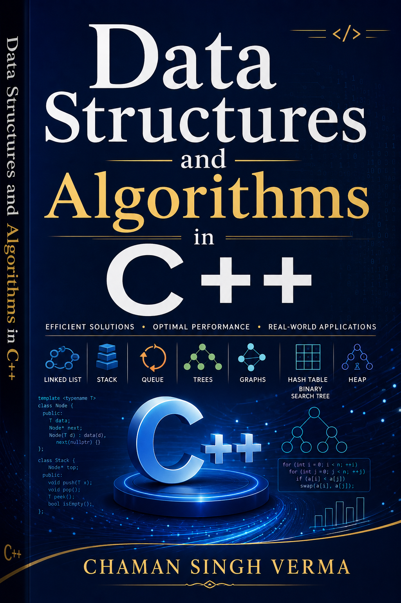

# Data Structures, Algorithms, and Applications in C++

<p align="center">
  
</p>

**First Edition — A Modern, C++20 Approach**

A comprehensive textbook covering fundamental and advanced data structures, algorithm-design paradigms, and modern C++ programming practices. This repository contains the full book content (chapters, TeX sources) and complete, compilable C++ code examples for every data structure and algorithm presented.

---

## Key Features

- **C++20 throughout** — RAII, smart pointers, concepts, `std::span`, ranges, coroutines, `constexpr`
- **Coverage gaps filled** — Probabilistic structures (Bloom filters, HyperLogLog), segment trees with lazy propagation, suffix arrays, Dinic's max-flow
- **Performance measurement** — `std::chrono`, Google Benchmark, profiling tools as a first-class topic
- **STL connections** — Every manual implementation compared with its standard library equivalent
- **Three-level exercises** — Drill, application, and research problems per chapter

## Repository Structure

```
DataStruct/
├── tex/               # LaTeX source files
│   ├── book.tex       # Master document
│   ├── chapters/      # Per-chapter .tex files
│   └── book.pdf       # Compiled PDF (873 pages)
├── code/              # C++ implementations and tests
│   ├── include/       # Header-only data structure libraries
│   ├── tests/         # Unit tests and usage examples
│   ├── CMakeLists.txt # CMake build
│   └── Makefile       # GNU Make build
└── books/             # Reference PDFs
```

## Book Contents

### Part I — Preliminaries
| Ch | Title | Topics |
|----|-------|--------|
| 1 | Modern C++ Review | RAII, smart pointers, concepts, move semantics, ranges, coroutines |
| 2 | Performance Analysis | Asymptotic notation, recursive analysis, amortized analysis, space complexity |
| 3 | Performance Measurement | `std::chrono`, Google Benchmark, profiling, memory measurement |

### Part II — Data Structures
| Ch | Title | Topics |
|----|-------|--------|
| 4 | Linear Lists | Array-based and linked lists, polynomial arithmetic |
| 5 | Arrays, Matrices & Sparse | Row/column-major, CSR/CSC, PageRank |
| 6 | Stacks | Array/linked stacks, balanced parentheses, postfix evaluation |
| 7 | Queues | Circular buffer, linked queue, deque |
| 8 | Hashing & Hash Tables | Chaining, open addressing, skip lists, Robin Hood, cuckoo, Swiss table |
| 9 | Trees & Binary Trees | Traversals, Huffman coding, expression trees |
| 10 | Priority Queues | Heaps, heap sort, leftist trees, event-driven simulation |
| 11 | Search Trees | BST, AVL, red-black, B-tree, treap |
| 12 | Graphs | Adjacency list/matrix, BFS, DFS, Dijkstra, Bellman-Ford, Floyd-Warshall, SCC |
| 13 | Strings & Tries | Tries, KMP, Rabin-Karp, suffix arrays, LCP |
| 14 | Segment/Fenwick/Union-Find | Range queries, BIT, DSU with inverse Ackermann |

### Part III — Algorithm-Design Methods
| Ch | Title | Topics |
|----|-------|--------|
| 15 | Greedy Method | Fractional knapsack, Huffman, Dijkstra, MST |
| 16 | Divide and Conquer | Merge sort, quick sort, closest pair, Strassen's |
| 17 | Dynamic Programming | 0/1 knapsack, LCS, edit distance, Floyd-Warshall |
| 18 | Backtracking & Branch and Bound | n-Queens, subset sum, TSP, 15-puzzle |
| 19 | Probabilistic Structures | Bloom filters, Count-Min sketch, HyperLogLog, reservoir sampling |
| 20 | Maximum Flow & Matching | Ford-Fulkerson, Edmonds-Karp, Dinic's, bipartite matching |

### Appendices
- **A** — C++ STL Quick Reference
- **B** — Complexity Classes and NP-Completeness
- **C** — Mathematical Review

## Building the Code

### Prerequisites

- **C++20** compiler (GCC 11+, Clang 14+, Apple Clang 15+, or MSVC 2022 17+)
- **CMake** 3.16+ (recommended) or **GNU Make**

### Using CMake

```bash
cd code
mkdir build && cd build
cmake ..
cmake --build .
ctest
```

### Using Make

```bash
cd code
make          # Build all examples
make test     # Build and run all tests
make clean    # Remove build artifacts
```

## Code Highlights

| Header | Data Structures / Algorithms |
|--------|------------------------------|
| `array_list.h` | Dynamic array list |
| `linked_list.h` | Singly linked list with unique_ptr, iterators, reverse |
| `sparse_matrix.h` | Sparse matrix (CSR/COO), transpose, matrix-vector multiply |
| `sparse_vector.h` | Sparse vector (dot, add, sub, scale) |
| `stacks.h` | Array-based & linked stacks |
| `queues.h` | Circular & linked queues |
| `deque.h` | Double-ended deque (circular buffer) |
| `bit_vector.h` | Bit vector (popcount, find_first/next, bitwise ops) |
| `hash_table.h` | Hash table with separate chaining |
| `binary_tree.h` | Binary tree traversals, BST insert/erase/find |
| `max_heap.h` | Max-heap & heap sort |
| `binomial_heap.h` | Binomial heap (mergeable) |
| `fibonacci_heap.h` | Fibonacci heap (amortized O(1) decrease-key) |
| `pairing_heap.h` | Pairing heap (simple, practical) |
| `avl_tree.h` | AVL balanced search tree |
| `red_black_tree.h` | Red-black tree (insert, delete, search) |
| `splay_tree.h` | Splay tree (self-adjusting BST) |
| `two_three_tree.h` | 2-3 tree (B-tree variant) |
| `suffix_tree.h` | Suffix tree (naive O(n²) construction) |
| `radix_tree.h` | Radix/Patricia trie (compressed) |
| `graph.h` | Adjacency list graph, BFS, DFS, Dijkstra, Bellman-Ford, Floyd-Warshall, topological sort, cycle detection, Kruskal's MST |
| `suffix_array.h` | Suffix array, LCP, substring search |
| `fenwick_segment.h` | Fenwick tree, segment tree, union-find |
| `sorting.h` | Insertion, merge, quick sort, quickselect, counting sort, radix sort, bucket sort |
| `bloom_filter.h` | Bloom filter, Count-Min sketch |
| `dinic.h` | Dinic's max-flow algorithm |

## Generating the PDF

```bash
cd tex
pdflatex book.tex
makeindex book
pdflatex book.tex
pdflatex book.tex
```

## License

All rights reserved by the author.

## Contributing

If you find errors in the code or text, please open an issue with:
- The chapter and section number
- A description of the error
- A suggested fix (if applicable)
